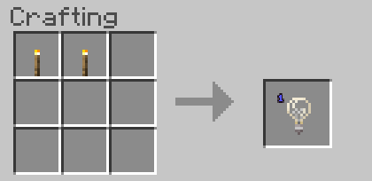
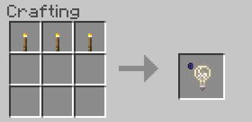
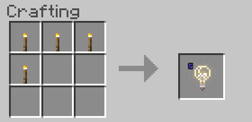
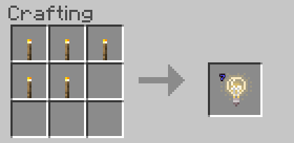
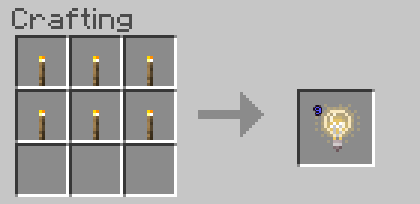
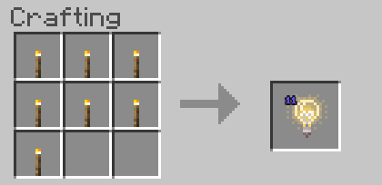
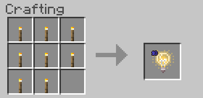
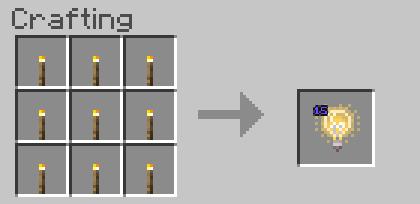

# SurvivalLightblocks Beta 0.0.6
Minecraft Bedrock survival craftable lightblocks

Adds Lightblocks (see https://minecraft.gamepedia.com/Light_Block) to survival.  Lightblocks are crafted with torches.

## Installing
To enable this addon:
* Enable expirimental gameplay in you world
* Install the SurvivalLightblocks.mcaddon

## Instructions
After enabling this addon (be sure to enable experimental gameplay) lightblocks can be crafted from torches.

2 torches gives a level 1 lightblock

3 torches gives a level 3 lightblock

4 torches gives a level 5 lightblock

5 torches gives a level 7 lightblock

6 torches gives a level 9 lightblock

7 torches gives a level 11 lightblock

8 torches gives a level 13 lightblock

9 torches gives a level 15 (max) lightblock

Please see the Minecraft Wiki for usage.  I have also created a video tutorial.

## License
ISC and CC0
